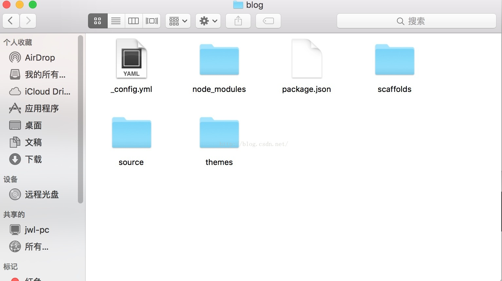

# Mac下利用Hexo+GitHub轻松搭建自己的博客


来自：
[GitHub Pages + Hexo搭建博客](https://crazymilk.github.io/2015/12/28/GitHub-Pages-Hexo%E6%90%AD%E5%BB%BA%E5%8D%9A%E5%AE%A2/)
[Mac下利用Hexo+GitHub轻松搭建自己的博客](http://blog.csdn.net/jasonjwl/article/details/52887575)
[利用Hexo搭建个人博客－环境搭建篇](http://www.cnblogs.com/xiaoxuetu/p/hexo-mac-environment.html)
[Hexo博客备份](https://www.jianshu.com/p/57b5a384f234)
[hexo博客图片问题](https://www.jianshu.com/p/c2ba9533088a)

1. 创建仓库sengolnhuang.github.io，如果同名仓库之前已经创建，请将之前的仓库改名，新建的仓库必须是Username.github.io；

2. 创建两个分支：master和source；

3. 设置hexo为默认分支；
4. 将刚刚创建的新仓库clone至本地，将之前的hexo文件夹中的`_config.yml`，`themes/`，`source/`，`scaffolds/`，`package.json`，`.gitignore`复制至`sengolnhuang.github.io`文件夹；
5. 将themes/next/(我用的是NexT主题)中的`.git/`删除，否则无法将主题文件夹push；
6. 在sengolnhuang.github.io文件夹执行`npm install`和`npm install hexo-deployer-git`（这里可以看一看分支是不是显示为hexo）；
执行`git add .`、`git commit -m ""`、`git push origin source`来提交hexo网站源文件；
执行`hexo g -d`生成静态网页部署至Github上。


### 2.3.2 与github建立联系
为了能够在本地使用git管理github上的项目，需要进行一些配置，这里介绍SSH的方法。

#### 2.3.2.1 检查电脑是否已经有SSH keys。
``` bash
$ ls -al ~/.ssh
total 0
drwx------   2 sengolnhuang  staff   64  1  8 09:16 .
drwxr-xr-x+ 25 sengolnhuang  staff  800  1  8 09:16 ..
# Lists the files in your .ssh directory, if they exist
```

默认情况下，public keys的文件名是以下的格式之一：id_dsa.pub、id_ecdsa.pub、id_ed25519.pub、id_rsa.pub。因此，如果列出的文件有public和private钥匙对（例如id_ras.pub和id_rsa），证明已存在SSH keys。

#### 2.3.2.2 如果没有SSH key，则生成新的SSH key。
```bash
$ ssh-keygen -t rsa -b 4096 -C "your_email@example.com"
# Creates a new ssh key, using the provided email as a label
```
之后一路回车即可。
大概长这样：
```bash
$ ssh-keygen -t rsa -b 4096 -C "huang1sheng2jun3@126.com"
Generating public/private rsa key pair.
Enter file in which to save the key (/Users/sengolnhuang/.ssh/id_rsa): 
Enter passphrase (empty for no passphrase): 
Enter same passphrase again: 
Your identification has been saved in /Users/sengolnhuang/.ssh/id_rsa.
Your public key has been saved in /Users/sengolnhuang/.ssh/id_rsa.pub.
The key fingerprint is:
SHA256:2KlCteQMJ544el0TwjJc0I9wEFWKbHaoVDauGY8Zbp0 huang1sheng2jun3@126.com
The key's randomart image is:
+---[RSA 4096]----+
|  +Xo..          |
| o==+.           |
| +X+Bo=          |
|o+X*o@.= .       |
|.BoE+ B S        |
|.. + . o         |
|. . o .          |
| .   .           |
|                 |
+----[SHA256]-----+
```
出现`Enter file in which to save the key (/Users/sengolnhuang/.ssh/id_rsa):`时按回车，出现`Enter passphrase (empty for no passphrase):` 和 `Enter same passphrase again: `都输入电脑的开机密码。

#### 2.3.2.3 向ssh-agent添加key。
首先确保ssh-agent可运行：
```bash
# start the ssh-agent in the background
$ ssh-agent -s
```
长这样：
```bash
$ ssh-agent -s
SSH_AUTH_SOCK=/var/folders/h2/hwz4jllx4fs_xy49xt_4630m0000gn/T//ssh-UdgaAuHTrug3/agent.1020; export SSH_AUTH_SOCK;
SSH_AGENT_PID=1021; export SSH_AGENT_PID;
echo Agent pid 1021;
```
 
然后添加SSH key：
```bash
$ ssh-add ~/.ssh/id_rsa
```
长这样：
```bash
$ ssh-add ~/.ssh/id_rsa
Enter passphrase for /Users/sengolnhuang/.ssh/id_rsa: 
Identity added: /Users/sengolnhuang/.ssh/id_rsa (/Users/sengolnhuang/.ssh/id_rsa)
```

#### 2.3.2.4 在GitHub添加SSH key。
首先，拷贝key：
```bash
clip < ~/.ssh/id_rsa.pub
# Copies the contents of the id_rsa.pub file to your cllipboard
```
长这样：
```bash
$ clip < ~/.ssh/id_rsa.pub
-bash: clip: command not found
```
出现`-bash: clip: command not found`的原因是在mac上，拷贝ssh-key的命令是`$ pbcopy < ~/.ssh/id_rsa.pub`。

然后，在GitHub右上方点击头像，选择"Settings"，在右边的"Personal settings"侧边栏选择"SSH  and GPG keys"，点击"New SSH key"，接着粘贴key，点击"Add SSH key"按钮。最后，测试链接：
```bash
$ ssh -T git@github.com
# Attempts to ssh to GitHub
```
如果你看到：
```bash
$ ssh -T git@github.com
The authenticity of host 'github.com (192.30.255.113)' can't be established.
RSA key fingerprint is SHA256:nThbg6kXUpJWGl7E1IGOCspRomTxdCARLviKw6E5SY8.
Are you sure you want to continue connecting (yes/no)?
```
就键入：yes。之后将会看到如下信息：
```bash
Warning: Permanently added 'github.com,192.30.255.113' (RSA) to the list of known hosts.
Hi sengolnhuang! You've successfully authenticated, but GitHub does not provide shell access.
```

### 2.3.3 相关资料
* [Generating SSH keys](https://help.github.com/articles/generating-ssh-keys/)


## 2.4 Hexo
### 2.4.1 安装Hexo
安装Hexo相当简单。在安装之前，必须检查电脑中是否已经安装下列应用程序：
* [Node.js](http://nodejs.org/)
* [Git](http://git-scm.com/)

### 安装homebrew
```bash
$ ruby -e "$(curl -fsSL https://raw.githubusercontent.com/Homebrew/install/master/install)"
==> This script will install:
/usr/local/bin/brew
/usr/local/share/doc/homebrew
/usr/local/share/man/man1/brew.1
/usr/local/share/zsh/site-functions/_brew
/usr/local/etc/bash_completion.d/brew
/usr/local/Homebrew
==> The following existing directories will be made group writable:
/usr/local/bin
/usr/local/etc
/usr/local/include
/usr/local/lib
/usr/local/share
/usr/local/share/doc
/usr/local/share/man
/usr/local/share/man/man1
==> The following existing directories will have their owner set to sengolnhuang:
/usr/local/bin
/usr/local/etc
/usr/local/include
/usr/local/lib
/usr/local/share
/usr/local/share/doc
/usr/local/share/man
/usr/local/share/man/man1
==> The following existing directories will have their group set to admin:
/usr/local/bin
/usr/local/etc
/usr/local/include
/usr/local/lib
/usr/local/share
/usr/local/share/doc
/usr/local/share/man
/usr/local/share/man/man1
==> The following new directories will be created:
/usr/local/Cellar
/usr/local/Homebrew
/usr/local/Frameworks
/usr/local/opt
/usr/local/sbin
/usr/local/share/zsh
/usr/local/share/zsh/site-functions
/usr/local/var
==> The Xcode Command Line Tools will be installed.

Press RETURN to continue or any other key to abort
==> /usr/bin/sudo /bin/chmod u+rwx /usr/local/bin /usr/local/etc /usr/local/include /usr/local/lib /usr/local/share /usr/local/share/doc /usr/local/share/man /usr/local/share/man/man1
==> /usr/bin/sudo /bin/chmod g+rwx /usr/local/bin /usr/local/etc /usr/local/include /usr/local/lib /usr/local/share /usr/local/share/doc /usr/local/share/man /usr/local/share/man/man1
==> /usr/bin/sudo /usr/sbin/chown sengolnhuang /usr/local/bin /usr/local/etc /usr/local/include /usr/local/lib /usr/local/share /usr/local/share/doc /usr/local/share/man /usr/local/share/man/man1
==> /usr/bin/sudo /usr/bin/chgrp admin /usr/local/bin /usr/local/etc /usr/local/include /usr/local/lib /usr/local/share /usr/local/share/doc /usr/local/share/man /usr/local/share/man/man1
==> /usr/bin/sudo /bin/mkdir -p /usr/local/Cellar /usr/local/Homebrew /usr/local/Frameworks /usr/local/opt /usr/local/sbin /usr/local/share/zsh /usr/local/share/zsh/site-functions /usr/local/var
==> /usr/bin/sudo /bin/chmod g+rwx /usr/local/Cellar /usr/local/Homebrew /usr/local/Frameworks /usr/local/opt /usr/local/sbin /usr/local/share/zsh /usr/local/share/zsh/site-functions /usr/local/var
==> /usr/bin/sudo /bin/chmod 755 /usr/local/share/zsh /usr/local/share/zsh/site-functions
==> /usr/bin/sudo /usr/sbin/chown sengolnhuang /usr/local/Cellar /usr/local/Homebrew /usr/local/Frameworks /usr/local/opt /usr/local/sbin /usr/local/share/zsh /usr/local/share/zsh/site-functions /usr/local/var
==> /usr/bin/sudo /usr/bin/chgrp admin /usr/local/Cellar /usr/local/Homebrew /usr/local/Frameworks /usr/local/opt /usr/local/sbin /usr/local/share/zsh /usr/local/share/zsh/site-functions /usr/local/var
==> /usr/bin/sudo /bin/mkdir -p /Users/sengolnhuang/Library/Caches/Homebrew
==> /usr/bin/sudo /bin/chmod g+rwx /Users/sengolnhuang/Library/Caches/Homebrew
==> /usr/bin/sudo /usr/sbin/chown sengolnhuang /Users/sengolnhuang/Library/Caches/Homebrew
==> /usr/bin/sudo /bin/mkdir -p /Library/Caches/Homebrew
==> /usr/bin/sudo /bin/chmod g+rwx /Library/Caches/Homebrew
==> /usr/bin/sudo /usr/sbin/chown sengolnhuang /Library/Caches/Homebrew
==> Searching online for the Command Line Tools
==> /usr/bin/sudo /usr/bin/touch /tmp/.com.apple.dt.CommandLineTools.installondemand.in-progress
==> Installing Command Line Tools (macOS High Sierra version 10.13) for Xcode-9.2
==> /usr/bin/sudo /usr/sbin/softwareupdate -i Command\ Line\ Tools\ (macOS\ High\ Sierra\ version\ 10.13)\ for\ Xcode-9.2
Software Update Tool


Downloading Command Line Tools (macOS High Sierra version 10.13) for Xcode

Downloaded Command Line Tools (macOS High Sierra version 10.13) for Xcode
Installing Command Line Tools (macOS High Sierra version 10.13) for Xcode
Done with Command Line Tools (macOS High Sierra version 10.13) for Xcode
Done.
==> /usr/bin/sudo /bin/rm -f /tmp/.com.apple.dt.CommandLineTools.installondemand.in-progress
==> /usr/bin/sudo /usr/bin/xcode-select --switch /Library/Developer/CommandLineTools
==> Downloading and installing Homebrew...
remote: Counting objects: 96087, done.
remote: Compressing objects: 100% (30/30), done.
error: RPC failed; curl 56 LibreSSL SSL_read: SSL_ERROR_SYSCALL, errno 60
fatal: The remote end hung up unexpectedly
fatal: early EOF
fatal: index-pack failed
Failed during: git fetch origin master:refs/remotes/origin/master --tags --force
```

## 新建一个空的文件夹，并进入到该文件夹中：
```bash
$ mkdir hexoblog
$ cd hexoblog/
```
### 初始化hexo
```bash
$ hexo init
INFO  Cloning hexo-starter to ~/Desktop/personal_documents/hexoblog
Cloning into '/Users/sengolnhuang/Desktop/personal_documents/hexoblog'...
remote: Counting objects: 62, done.
remote: Total 62 (delta 0), reused 0 (delta 0), pack-reused 62
Unpacking objects: 100% (62/62), done.
Submodule 'themes/landscape' (https://github.com/hexojs/hexo-theme-landscape.git) registered for path 'themes/landscape'
Cloning into '/Users/sengolnhuang/Desktop/personal_documents/hexoblog/themes/landscape'...
remote: Counting objects: 785, done.        
remote: Total 785 (delta 0), reused 0 (delta 0), pack-reused 785        
Receiving objects: 100% (785/785), 2.53 MiB | 26.00 KiB/s, done.
Resolving deltas: 100% (409/409), done.
Submodule path 'themes/landscape': checked out '73a23c51f8487cfcd7c6deec96ccc7543960d350'
INFO  Install dependencies
npm WARN deprecated swig@1.4.2: This package is no longer maintained

> fsevents@1.1.3 install /Users/sengolnhuang/Desktop/personal_documents/hexoblog/node_modules/fsevents
> node install

[fsevents] Success: "/Users/sengolnhuang/Desktop/personal_documents/hexoblog/node_modules/fsevents/lib/binding/Release/node-v59-darwin-x64/fse.node" is installed via remote
npm notice created a lockfile as package-lock.json. You should commit this file.
added 430 packages in 20.733s
INFO  Start blogging with Hexo!
```
此时blog文件下出现了很多文件和文件夹，如下图所示：


此时可以测试下新建一个博客：
```bash
$ hexo new "我的第一篇博客"
INFO  Created: ~/Desktop/personal_documents/sengolnhuang.github.io/source/_posts/我的第一篇博客.md
```
在`source/_posts`中即可看到对应的`.md`文件。

接下来安装必要的插件：

2> 安装便于自动部署到Github上的插件
```bash
$ npm install hexo-deployer-git --save
+ hexo-deployer-git@0.3.1
updated 1 package in 5.985s
```

3> 安装atom生成插件，便于感兴趣的小伙伴们订阅
```bash
$ npm install hexo-generator-feed --save
+ hexo-generator-feed@1.2.2
added 3 packages in 6.685s
```

4> 安装博客首页生成插件
```bash
$ npm install hexo-generator-index --save
+ hexo-generator-index@0.2.1
updated 1 package in 3.091s
```

5> 安装归档生成插件
```bash
$ npm install hexo-generator-archive --save
+ hexo-generator-archive@0.1.5
updated 1 package in 3.15s
```

6> 安装tag生成插件
```bash
$ npm install hexo-generator-tag --save
+ hexo-generator-tag@0.2.0
updated 1 package in 2.971s
```

7> 安装category生成插件
```bash
$ npm install hexo-generator-category --save
+ hexo-generator-category@0.1.3
updated 1 package in 3.184s
```

8> 安装Sitemap文件生成插件
```bash
$ npm install hexo-generator-sitemap --save
+ hexo-generator-sitemap@1.2.0
added 1 package in 5.117s
```

9> 安装百度Sitemap文件生成插件，因为普通的Sitemap格式不符合百度的要求
```bash
$ npm install hexo-generator-baidu-sitemap --save
npm WARN deprecated ejs@1.0.0: Critical security bugs fixed in 2.5.5
+ hexo-generator-baidu-sitemap@0.1.2
added 3 packages in 5.78s
```

然后发布到GitHub上：
```bash
$ hexo g
INFO  Start processing
INFO  Files loaded in 207 ms
INFO  Generated: baidusitemap.xml
INFO  Generated: sitemap.xml
//... ...
$ hexo d
```
同时提交所有文件到`source`分支中：
```bash
$ git add .
$ git commit -m "提交hexo博客的sorce文件"
$ git push origin source
```

## 其他问题：
### 1、如果之前生成SSH-key时输入了密码，但是不想每次`git push`和`hexo d`时都要输入密码？
重新生成SSH-key，并复制到Github上：
```bash
## 生成新的SSH key
$ ssh-keygen -t rsa -b 4096 -C "huang1sheng2jun3@126.com"
## 确保ssh-agent可运行
$ ssh-agent -s
## 添加SSH key
$ ssh-add ~/.ssh/id_rsa
## 拷贝key
$ pbcopy < ~/.ssh/id_rsa.pub
```

### 2、希望`hexo new "xxx"`时同时创建该`.md`文件对应的文件夹？
只需要把`_config.yml`中的`post_asset_folder`设置为`true`即可。


